# 문자열 (String)

### 컴퓨터에서의 문자표현

- 영어는 대소문자 합쳐서 52이므로 6(64가지)비트면 모두 표현할 수 있다.
- **코드체계**라고 부른다.
- 지역마다 해석이 달라 혼동을  피하기 위해 **표준안**을 만들기로 했다.

### ASCII(American Standard Code for Information Interchanber)

- 문자 인코딩 표준이 제정

- 7bit 인코딩으로 128문자를 표현하며 33개의 출력 불가능한 제어 문자들과 공백을 비롯한 95개의 출력 가능한 문자들로 표현
  
  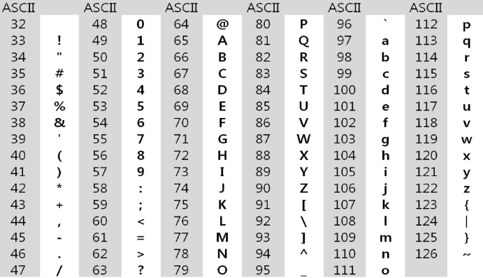
  
  - 확장 아스키는 표준 문자 이외에 악센트, 도형, 특수 문자 등 부가적인 128개의 문자를 추가할 수 있게 하는 부호이다.
  - 표준 아스키는 7bit 사용, 확장 아스키는 1B 내의 8bit 사용
  - 확장 아스키는 프로그램이나 컴퓨터 또는 프린터가 그것을 해독할 수 있도록 설계되 있어야 함
    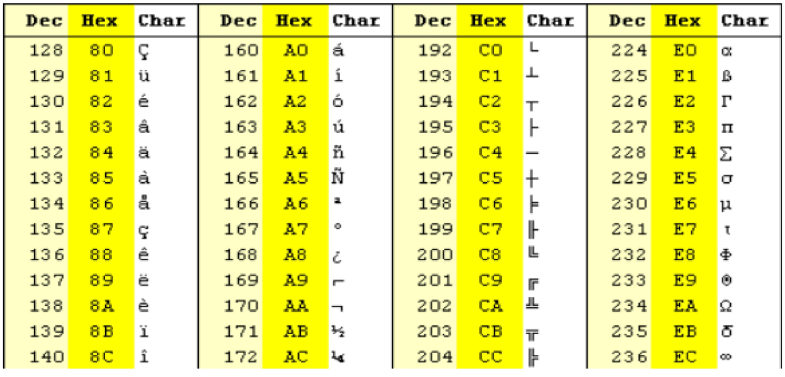

### 유니코드

- 각 국에서 자국 문자 표현을 하기 위해 만든 코드 등 다국어 처리를 위해 만든 표준
- Character Set으로 분류된다.
  - UCS-2(Universal Character Set 2)
  - UCS-4(Universal Character Set 4)
- 유니코드를 저장하는 변수의 크기를 정의 
- 단, 바이트 순서에 대해 표준화 하지못하여 이 파일이 UCS-2, UCS-4인지 인식하고 각 경우 구분해서 다르게 구현해야되는 문제
- 적당한 외부 인코딩이 필요하게 됬다.

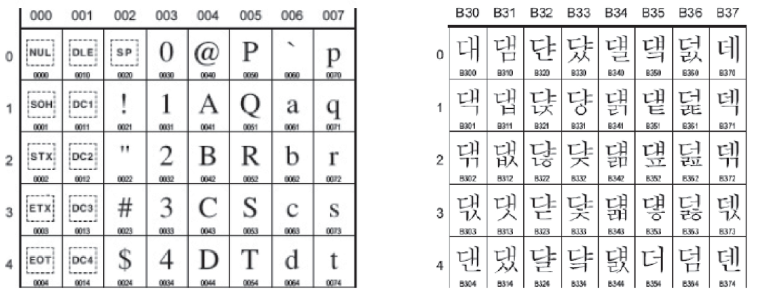

> 유니코드 인코딩(UTF: Unicode Transformation Format)

- UTF-8(in web)
  - MIN: 8bit , MAX: 32bit(1Byte*4)
- UTF-16(in windows, java)
  - MIN: 8bit , MAX: 32bit(2Byte*2)
- UTF-32(in unix)
  - MIN: 32bit , MAX: 32bit(4Byte*1)

## 문자열 분류

- 문자열 (string)
  1. fixed length
  2. variable length
     - length controlled (java)
     - delimited (c언어)

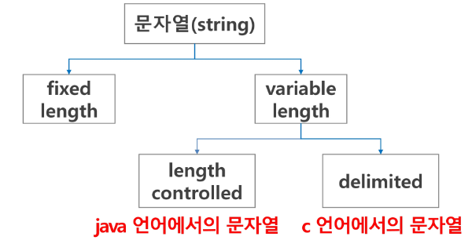

> **java에서 String 클래스에 대한 메모리 배치**

- 객체 메타 데이터 외에도 네 가지 필드들이 포함
- hash, 문자열 길이(count), 문자열 데이터의 시작점(offset), 실제 문자열 배열(value)
  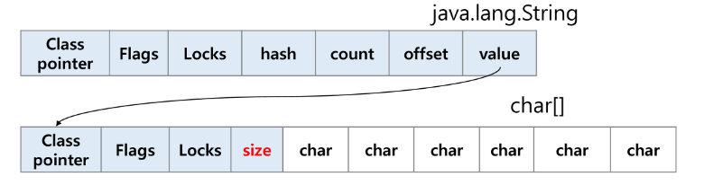

> **C언어에서 문자열 처리**

- 문자열은 문자들의 배열 형태로 구현된 응용 자료형
- 문자배열에 문자열을 저장할 때는 항상 마지막에 끝을 표시하는 널문자('\0')를 넣어줘야 한다.
  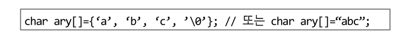
- 문자열 처리에 필요한 연산을 함수 형태로 제공한다.

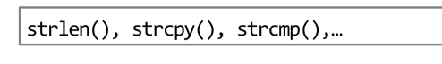

> **java(객체지향)에서 문자열 처리**

- 문자열 데이터를 저장, 처리해주는 클래스를 제공
- String 클래스를 사용한다.

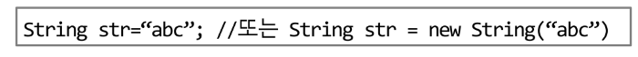

- 문자열 처리에 필요한 연산을 연산자, 메소드 형태로 제공
- +, length(), replace(), split(), substring(), ...
- 보다 풍부한 연사을 제공

> **python에서의 문자열 처리**

- char 타입 없음

- 텍스트 데이터의 취급방법이 통일되어 있음

- 문자열 기호
  
  - '(홑따옴표), "(쌍따옴표), '''(홑따옴표 3개), """(쌍따옴표 3개)
  - + 연결(Concatenation)
    - 문자열+문자열: 이어붙여주는 역할
  - * 반복
    - 문자열*수: 수만큼 문자열이 반복

- 문자열은 시퀀스 자료형으로 분류되고, 시퀀스 자료형에서 사용할 수 있는 인덱싱, 슬라이싱 연산들을 사용할 수 있음

- 문자열 클래스에서 제공되는 메소드

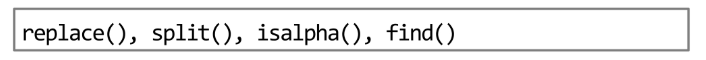

- 문자열은 튜플과 같이 요소값을 변경 할 수 없음(**immutable**)

#### C와 Java의 String 처리의 기본적인 차이점

- c는 아스키 코드로 저장한다.
- java는 유니코드(UTF16, 2byte)로 저장한다.
- python은 유니코드 (UTF8)로 저장

> **문자열 뒤집기**

1. 자기 문자열에서 뒤집는 방법
   
   - SWAP을 위한 임시 변수가 필요하며 반복 수행을 문자열 길이의 반만 수행.
     - 문자열 길이 9 -> 9/2 = 4.5 -> 4회반복

2. 새로운 빈 문자열을 만들어 소스의 뒤에서부터 읽어서 타겟에 쓰는 방법
   
   ```python
   #1
   s = s[::-1]
   #2
   s = 'abcd'
   s = list(s)
   s.reverse()
   s= ".join(s)
   #3
   for 이용해서 구현
   ```

> **문자열 비교**

- C : strcmp() 함수를 제공한다.
- Java : equals() 메소드를 제공
  - 문자열 비교에서 == 연산은 메모리 참조가 같은지 묻는 것
- Python : ==연산자와 is연산자를 제공
  - == 연산자는 두 문자가 같은지, is 연산자는 메모리 참조가 같은지 확인
  - == 연산자는 내부적으로 특수 메서드 __eq__() 호출

> **문자열 숫자를 정수로 변환**

- C: atoi() 함수를 제공. 역 함수로는 itoa()

- java에서는 숫자 클래스의 parse 메소드 제공
  
  - 예: Inetger.parseInt(String)
  - 역함수로는 toString() 메소드를 제공

- 파이썬에서는 숫자와 문자변환 함수를 제공
  
  - ex) int("123"), float("3.14"), str(123), repr(123)

- **str 사용하지 않고, itoa() 구현**
  
  ```python
  def itoa(num):
    # 음수 판별
      negative = False
      if num < 0:
          negative = True
          num = -num
      if num == 0:
          return '0'
      # 넘겨받은 정수를 0이 되기 전까지 계속 반복
      result = ''
      while num:
          # 일의 자리 수부터 끊어서 문자열로 변환
          remainder = num % 10
          # atoi -> ord(char) - ord('0')
          result = chr(ord('0')+ remainder) + result
          num = num //10
      # 만약 처음 넘겨 받은 값이 음수였다면
      if negative:
          # 문자열 앞에 '-'를 붙여서 반환한다.
          return '-' +result
      else:
          return result
  print(itoa(123))
  print(itoa(0))
  ```

## 패턴 매칭

패턴 매칭에 사용되는 알고리즘

- 고지식한 패턴 검색 알고리즘
- KMP 알고리즘
- 보이어-무어 알고리즘

#### **1. 고지식한 알고리즘(Brute Force)**

- 본문 문자열을 처음부터 끝까지 차례대로 순회하면서 패턴 내의 문자들을 일일이 비교하는 방식으로 동작
- 시간 복잡도 : O(NM) 이지만 O(N^2)일 수도 있다.

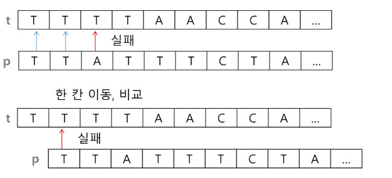

```python
p = "is" # 찾을 패턴
t = "This is a book~!" # 전체 텍스트
M = len(p) # 찾을 패턴의 길이
N = len(t) # 전체 텍스트의 길이

def BruteForce(p, t):
    i = 0 # t의 인덱스
    j = 0 # p의 인덱스
    while j < M and i < N:
        if t[i] != p[j]:
            i = i - j
            j = -1
        i = i+1
        j = j+1
    if j == M: retrun i - M # 검색 성공
    else: return -1 # 검색 실패
```

- 위 예제의 경우 최악의 경우 약 10,000*80 = 800,000번의 비교가 일어난다.

#### **2. KMP 알고리즘**

- 비교횟수를 줄이기 위해 사용

- 불일치가 발생한 텍스트 스트링의 앞 부분에 어떤 문자가 있는지를 미리 알고 있으므로, 불일치가 발생한 앞 부분에 대하여 다시 비교하지 않고 매칭을 수행

- 패턴을 전처리하여 배열 next[M]을 구해서 잘못된 시작을 최소화함
  
  - next[M]: 불일치가 발생했을 경우 이동할 다음 위치

- 시간 복잡도 : O(M+N)

> 과정

1. 텍스트에서 abcdabc까지는 매치되고, e에서 실패한 상황 패턴의 맨 앞의 abc와 실패 직전의 abc는 동일함을 이용
2. 실패한 텍스트 문자와 P[4]를 비교


3. 매칭이 실패했을 때 돌아갈 곳을 계산한다.

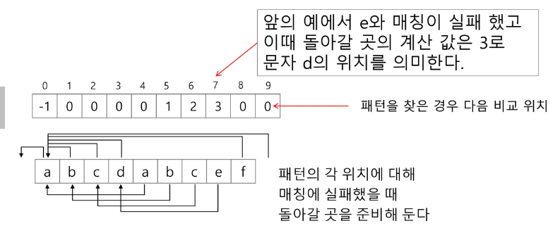

**3. 보이어-무어 알고리즘**

- 오른쪽에서 왼쪽으로 비교

- 대부분의 상용 소프트웨어에서 채택하고 있는 알고리즘

- 보이어-무어 알고리즘은 패턴에 오른쪽 끝에 있는 문자가 불일치 하고 이 문자가 패턴 내에 존재하지 않는 경우, 이동 거리는 무려 패턴의 길이만큼이 된다.

- 오른쪽 끝에 있는 문자가 불일치 하고 이 문자가 불일치 하고 이 문자가 패턴 내에 존재할 경우
  
  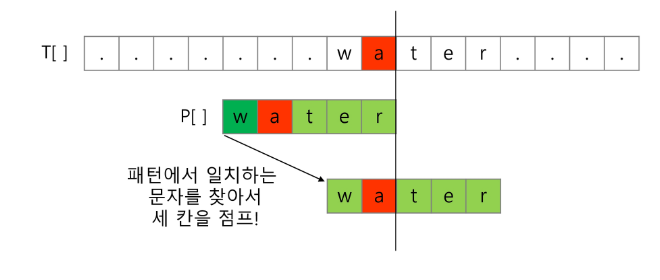

> 예시 

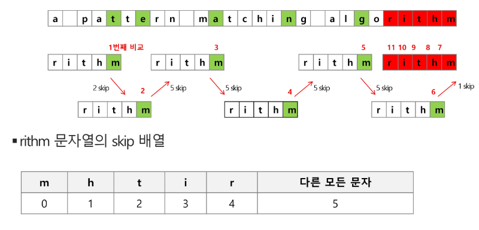

> 특징

- 앞의 두 매칭 알고리즘들의 공통점 : 텍스트 문자열의 문자를 적어도 한번씩 훑는다는 것. 따라서 최선의 경우에도 O(n)
- 보이어-무어 알고리즘은 텍스트 문자 다 보지 않아도 된다.
- 최악의 수행시간 O(mn)
- 입력에 따라 다르지만 일반적으로 O(n)보다 시간 덜든다.

> **문자열 매칭 알고리즘 비교**

- 찾고자 하는 문자열 패턴의 길이 m, 총 문자열 길이 n
- 고지식한 패턴 검색 알고리즘 : 수행시간 O(mn)
- 카프-라빈 알고리즘: 수행시간 O(n)
- KMP 알고리즘 : 수행시간 O(n)
