# Web

### 웹 사이트 간략하게 살펴보기

> 웹 사이트란 ?

- 브라우저를 통해 접속하는 웹 페이지(문서)들의 모음
- 웹 페이지는 여러가지 정보들을 담고 있으며 **링크**들이 존재하고, **링크**를 통해 여러 웹 페이지를 연결한 것이 `웹 사이트`

> 구성 요소

1. HTML - 구조
2. CSS - 표현
3. Javascript - 동작

> 브라우저

- 크롬, edge, firefox ...
- 브라우저마다 동작이 약간씩 달라 문제 생기는 경우 많음(`파편화`)
- **해결책**으로 `웹 표준`이 등장

> 웹 표준

- 웹에서 표준적으로 사용되는 기술이나 규칙
- 어떤 브라우저든 웹 페이지가 동일하게 보임(`크로스 브라우징`)

---

# HTML (Hyper Text Markup Language)

- 웹 페이지를 작성(구조화)하기 위한 언어

> Hyper Text

- 참조(하이퍼링크)를 통하여 한 문서에서 다른 문서로 즉시 접근할 수 있는 텍스트
- 문서와 문서를 이을 수 있는 기술

> Markup Language

- 태그 등을 이용하여 문서나 데이터의 구조를 명시하는 언어

- ex) HTML, Markdown
  
  **step** - 역순으로 진행된다고 보면 된다.

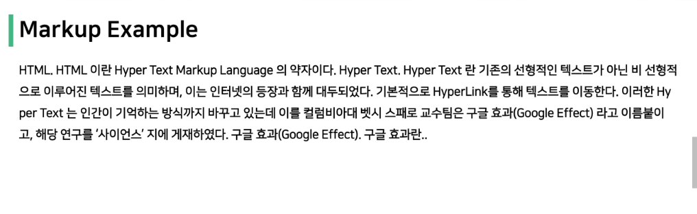


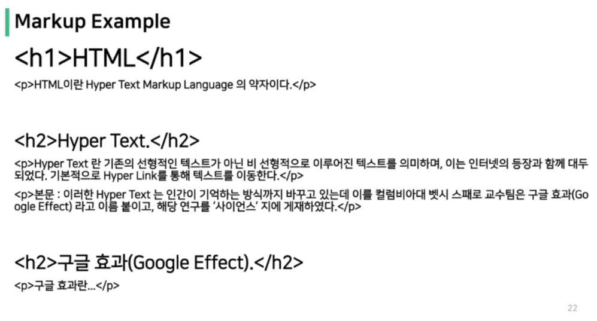

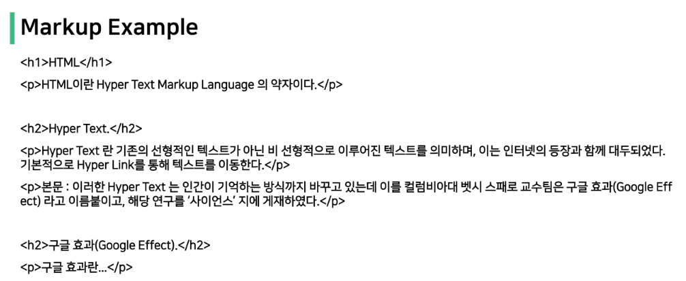

> 스타일 가이드

1. html = 2space, python = 2space
2. 기본 구조
- html : 문서의 최상위(root) 요소
- head : 문서의 메타데이터 요소
  : 문서 제목, 인코딩, 스타일 외부 파일 로딩 등 일반적으로 브라우저에 나타나지 않는 내용
- body: 문서 본문 요소
  : 실제 화면 구성과 관련된 내용

>  예시

1. title : 브라우저 상단 타이틀
2. meta : 문서 레벨 메타데이터 요소
3. link : 외부 리소스 연결 요소 (CSS 파일, favicon 등)
4. script : 스크립트 요소 (JavaScript 파일/코드)
5. style : CSS 직접 작성

> 요소(element)

1. 태그와 내용으로 구성
- `<h1> contents</h1>`
- 태그로 컨텐츠를 감싸는 것으로 그 정보의 성격과 의미를 정의
- 내용이 없는 태그들도 존재(닫는 태그 없음)
2. 요소는 중첩될 수 있음
- 요소의 중첩을 통해 하나의 문서를 구조화
- 여는 태그와 닫는 태그의 쌍을 잘 확인 해야됨(레이아웃이 깨진 채로 출력)

> 속성(attribute)

- `<a href="https://google.com"></a>`
- href = 속성명, 주소 = 속성값
- 태그별로 사용할 수 있는 속성 다르다
  **작성 방식**
- 속성명과 속성값 사이 공백 x
- " 쌍따옴표 " 사용
1. 태그의 부가적인 정보를 설정할 수 있음
2. 요소는 속성을 가질 수 있으며, 경로나 크기와 같은 추가 정보 제공
3. 요소의 시작 태그에 작성하며 보통 이름과 값이 하나의 쌍으로 제공
4. 태그와 상관없이 사용 가능한 속성들도 있음

> HTML Global Attribute

- 모든 HTML 요소가 공통으로 사용할 수 있는 대표적인 속성
1. id : 문서 전체에서 유일한 고유 식별자 지정
2. class : 공백으로 구분된 해당 요소의 클래스 목록(CSS, JS에서 요소를 선택하거나 접근)
3. data-*: 페이지에 개인 사용자 정의 데이터를 저장하기 위해 사용
4. sytle : inline 스타일
5. title : 요소에 대한 추가 정보 지정
6. tabindex : 요소의 탭 순서

> 시맨틱 태그

- HTML 태그가 특정 목적, 역할 및 의미적 가치(semantic value)를 가지는 것
  :(ex - h1 태그는 최상위 제목인 텍스트를 감싸는 역할)
  
  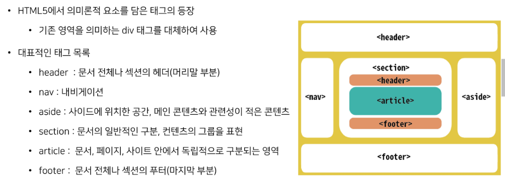

**사용 이유**

- 의미 있는 정보의 그룹을 태그로 표현
- 요소의 의미가 명확해지기 때문에 코드의 가독성을 높이고 유지보수를 쉽게 함
- 검색 엔진 최적화를 위해 메타태그, 시맨틱 태그 등을 통한 마크업을 효과적으로 활용 해야함

> 렌더링

1. 웹사이트의 코드를 사용자가 보게 되는 웹 사이트로 바꾸는 과정
2. **DOM(Document Object Model) 트리**
- 텍스트 파일인 HTML 문서를 브라우저에서 렌더링 하기 위한 구조
- HTML 문서에 대한 모델을 구성함
- HTML 문서 내의 각 요소에 접근/수정에 필요한 프로퍼티와 메서드를 제공함

#### 구조화

> 인라인/블록 요소

- 인라인 요소는 글자 취급
- 블록 요소는 한 줄 모두 사용

> 텍스트 요소

 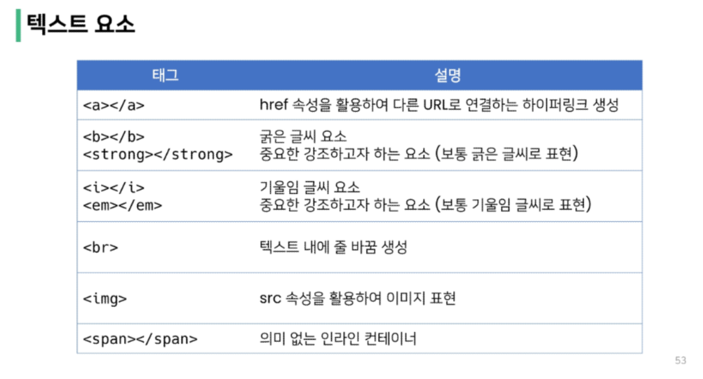

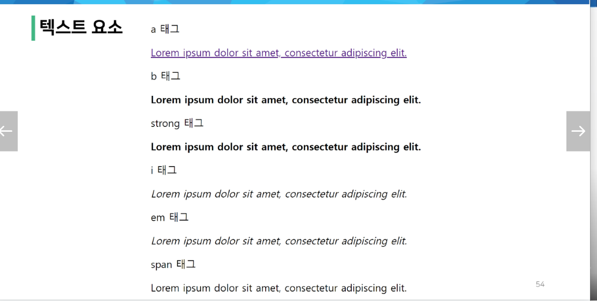

> 그룹 요소

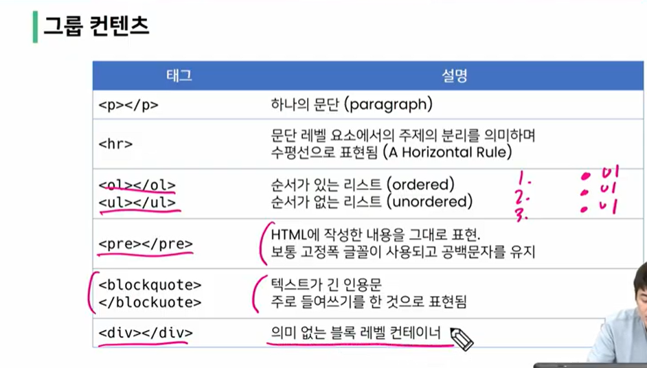

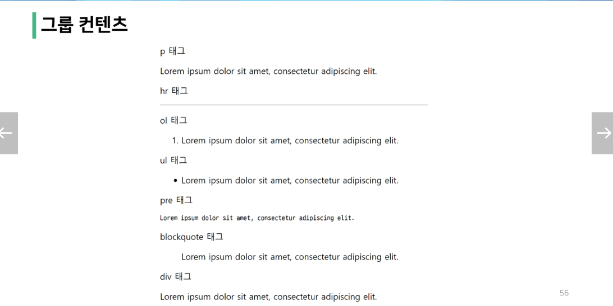

> 중요!! **form** 

- 사용자로부터 정보를 입력받기 위하여 사용 (로그인 창), (Django에서 깊게 배움)
- 즉, 정보(데이터)를 서버에 제출하기 위해 사용하는 태그
- 속성
  1. action : form을 처리할 서버의 URL
  2. method : form을 제출할 때 사용할 HTTP 메서드(GET 혹은 POST)
  3. enctype : method가 post인 경우 데이터의 유형
     - application / x-www-form=urlencoded : 기본값
     - multipart/form-data : 파일 전송시 (input type이 file인 경우)

> input

- form과 비슷하지만 form의 내부에서 사용
- 다양한 타입을 가지는 입력 데이터 유형과 위젯이 제공
- 속성
  1. name : form control에 적용되는 이름 (이름/값 페어로 전송됨)
  2. value : form control에 적용되는 값 (이름/값 페어로 전송됨)
  3. required, readonly, autofocus 등등... 

> input label

- label을 클릭하여 input 자체의 초점을 맞추거나 활성화 시킬 수 있음
  1. 사용자는 선택할 수 있는 영역이 늘어나 웹/모바일(터치) 환경에서 편하게 사용할 수 있음
  2. label과 input 입력의 관계가 시각적 뿐만 아니라 화면리더기에서도 label을 읽어 쉽게 내용 확인 가능
- `<input>`에는 id 속성을, `<label>`에는 for 속성 활용하여 상호연관
- label -> input 태그의 설명 in form

##### input유형 -일반

1. text
2. password - *로 표시
3. email - email형식 아니면 제출 불가
4. number - min, max,step 속성 활용하여 숫자 범위 설정 가능
5. file

##### input유형 - 항목 중 선택

1. checkbox - 다중선택
2. radio - 단일선택 

##### input유형 - 기타

1. color - colorpicker
2. date - datepicker
3. hidden - 사용자에게 보이지 않는 input

> input 요소의 동작은 type에 따라 달라지므로 숙지할 것 !

### 마크업 해보기

1. header
   
   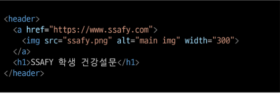

2. section
   
   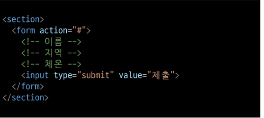
   
   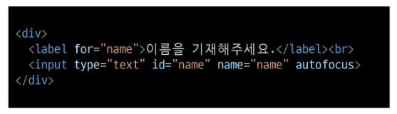
   
   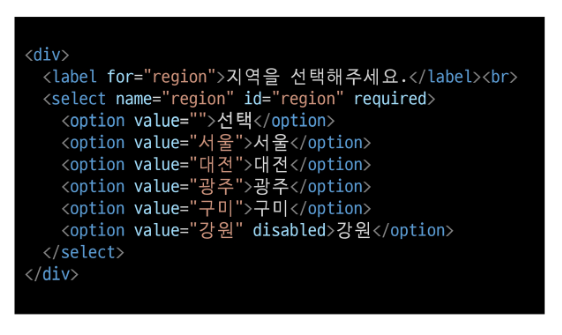
   
   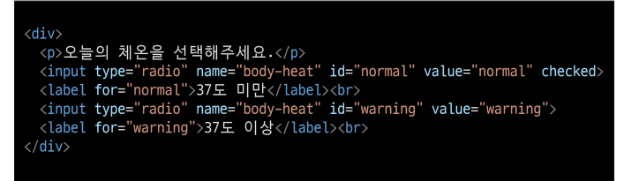

3. footer
   
   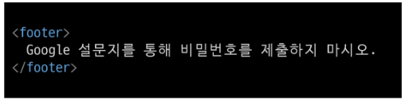

---

# CSS (Cascading Style Sheets)

- 상속이 되어 하나하나 할당하기 쉽지 않음

- 스타일을 지정하기 위한 언어, **선택하고, 스타일을 지정한다.**
  
  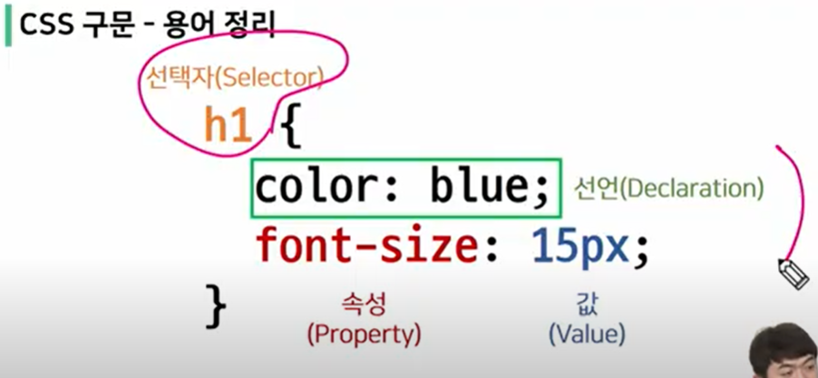

#### 정의방법

- 인라인
  : 해당 태그에 직접 style 활용
  : 중복도 있을 것이고, 찾기 어려워서 실수가 잦아짐
  
  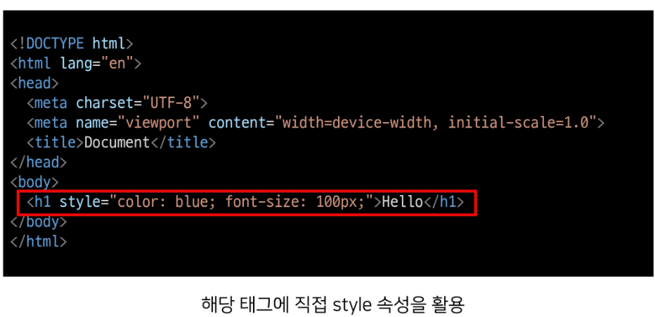

- 내부 참조 -`<style>`
  : 코드가 너무 길어짐
  
  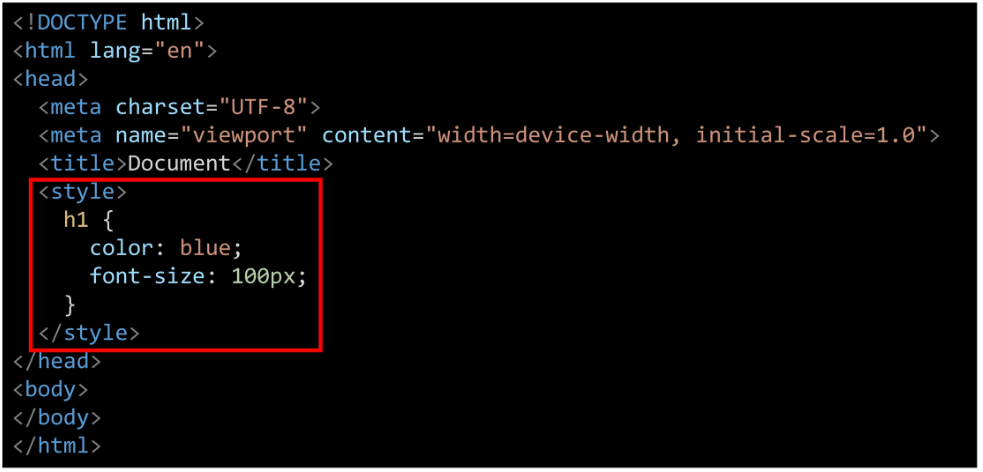

- 외부 참조 - 분리된 CSS 파일
  : 가장 많이 사용  
  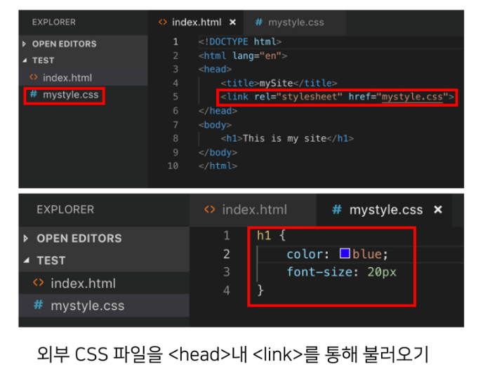

#### CSS with 개발자 도구

1. styles : 해당 요소에 선언된 모든 CSS
2. computed : 해당 요소에 최종 계산된 CSS

##### 선택자 with 개발자 도구

1. 기본 선택자
   
   - 전체 선택자, 요소 선택자
   - 클래스 선택자, 아이디 선택자, 속성 선택자

2. 결합자(combinators)
- 자손 결합자, 자식 결합자

- 일반 형제 결합자, 인접 형제 결합자
3. 의사 클래스/요소(Pseudo Class)
- 링크, 동적 의사 클래스

- 구조적 의사 클래스, 기타 의사 클래스, 의사 엘리먼트, 속성 선택자
  
  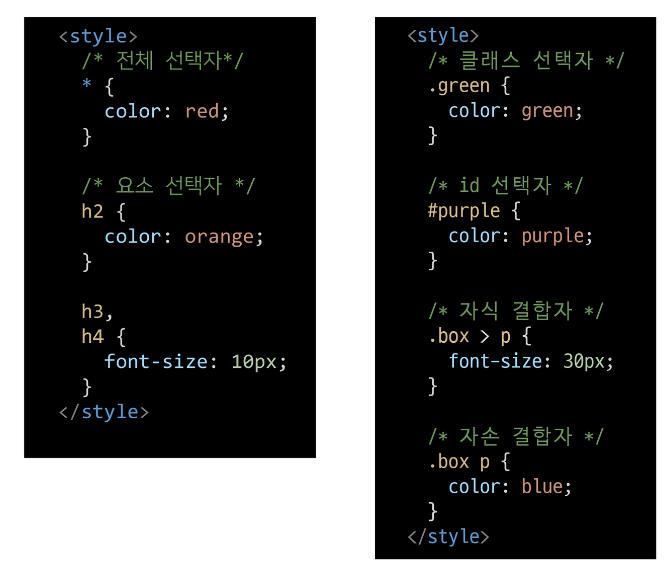

> 선택자 정리(아래로 내려갈수록 좁아짐)

- 요소 선택자
  
  - HTML 태그를 직접 선택

- 클래스 선택자
  
  - 마침표(.)문자로 시작하며, 해당 클래스가 적용된 항목 선택

- 아이디 선택자
  
  - #문자로 시작하며, 해당 아이디가 적용된 항목 선택
  - 일반적 하나 문서 1번
  - 여러 번 상관없지만, 단일 ID를 사용하는 것 권장

#### CSS적용 우선순위(CASCADING ORDER)

- **범위가 좁을수록 강하다**
1. 중요도 -사용시 주의
   : !important
2. 우선순위(Specificity)
   : 인라인 > id > class, 속성, pseudo-class > 요소, pseudo-element
3. CSS 파일 로딩 순서
   : 밑에 있는 애가 이긴다.

## CSS 상속

- CSS는 상속을 통해 부모 요소의 속성을 자식에게 상속
  - 속성(프로퍼티) 중에는 상속이 되는 것과 되지 않는 것들이 있음.
  - 상속 되는 것 : Text 관련 요소 등
  - 상속 되지 않는 것 : Box model 관련 요소, 레이아웃 등

#### CSS 기본 스타일

- 크기 
  
  - px(픽셀)
    : 모니터 해상도의 한 화소인 '픽셀' 기준
    : 픽셀의 크기는 변하지 않기 때문에 고정적인 단위
  
  - %
    : 백분율 단위
    : 가변적인 레이아웃에서 자주 사용
  
  - em 
    : (바로 위, 부모 요소에 대한) 상속의 영향을 받음
    : 배수 단위, 요소에 지정된 사이즈에 상대적인 사이즈를 가짐
  
  - rem (기본 16px)
    : (바로 위, 부모 요소에 대한) 상속의 영향을 받지 않음
    : 최상위 요소(html)의 사이즈를 기준으로 배수 단위를 가짐

- 크기 단위(view port)
  
  - 방문한 유저에게 바로 보이게 되는 웹 컨텐츠의 영역
  - 디바이스의 viewport를 기준으로 상대적인 사이즈가 결정
  - vw, vh, vmin, vmax
    : px는 브라우저의 크기 변경해도 그대로
    : vw는 브라우저의 크기에 따라 변함

- 색상
  
  - 색상 키워드(background-color: red;)
    - 대소문자 구분 x
  - RGB 색상(background-color: rgb(0, 255, 0);)
    - 16진수 표기법 혹은 함수형 표기법을 사용해서 특정 색을 표현하는 방식
    - '#' + 16진수 표기법
    - rgb() 함수형 표기법
  - HSL 색상(background-color: hsl(0, 100%, 50%);)
    - 색상 채도, 명도를 통해 특정 색을 표현하는 방식
  - a는 alpha(투명도)

- 텍스트 
  
  - 서체(font-family), 서체 스타일(font-style, font-weight 등)
    - 자간(letter-spacing), 단어 간격(word-spacing), 행간(line-height) 등
  - 컬러(color), 배경(background-image, background-color)
  - 기타 HTML 태그별 스타일링
    - 목록, 표

## CSS Selectors

#### 결합자 (Combinators)

- 자손 결합자 (공백)
  - selectorA 하위의 모든 selectorB 요소
- 자식 결합자 (>)
  - selectorA 바로 아래의 selectorB 요소
- 일반 형제 결합자(~)
  - selectorA의 형제 요소 중 뒤에 위치하는 selectorB 요소를 모두 선택
- 인접 형제 결합자(+)
  - selectorA의 형제 요소 중 바로 뒤에 위치하는 selectorB 요소를 선택

## Box model

- 원칙
  
  - 모든 요소는 네모이고, 위에서 아래로, 왼쪽에서 오른쪽으로 쌓인다.
  - display에 따라 크기와 배치가 달라진다

- 하나의 박스는 네 부분(영역)으로 이루어짐
  
  1. margin
     
     ```css
     .margin{
     margin-top: 10px;
     margin-right: 20px;
     margin-bottom: 30px;
     margin-left: 40px;
     } /* 상하좌우
     ```
  
  2. border
     
     ```css
     .border{
     border-width: 2px;
     border-style: dashed;
     border-color: black;
     ```

}/* 상하좌우

```
  3. padding
```css
.margin-padding{
  margin: 10px;
  padding: 30px;
} /* 상하좌우
```

4. content
   
   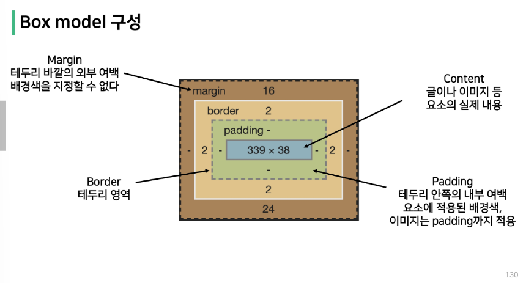
   
   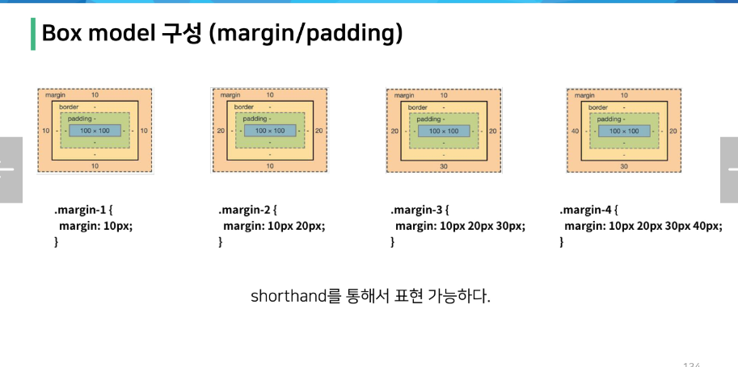
   
   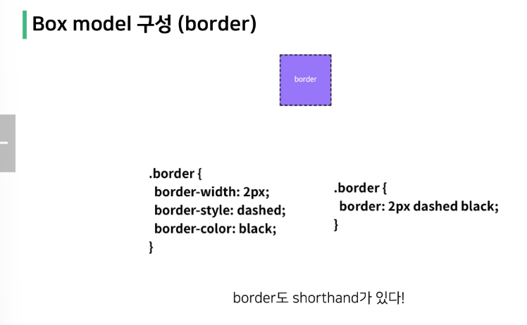

#### BOX-SIZING

- 기본적으로 모든 요소의 box-sizing은 content-box
  - Padding을 제외한 순수 contents 영역만을 box로 지정
- 다만, 우리가 일반적으로 영역 볼 때는 border까지 너비를 100px 보는 것을 원함
  - 그 경우 box-sizing을 border-box로 설정

### Display

- 대표적 사용 display
1. display: block
   
   - 줄바꿈이 발생
   - 화면크기 전체의 가로 폭을 차지한다.
   - 블록 레벨 요소 안에 인라인 레벨 요소 들어갈 수 있음
   - 기본 너비는 가질 수 있는 너비의 100%

2. display: inline
   
   - 줄 바꿈이 일어나지 않는 행의 일부 요소
   - content 너비만큼 가로 폭을 차지한다.
   - width, height, margin-top, margin-bottom을 지정할 수 없다.
   - 상하 여백은 line-height로 지정한다
   - inline의 기본 너비는 컨텐츠 영역만큼

> 블록 레벨 요소와 인라인 레벨 요소

- 블록 레벨 : div/ ul, ol, li/ p/ hr/ form 등
- 인라인 레벨 : span/ a/ img/ input, label/ b, em, i, strong 등

##### 속성에 따른 수평 정렬

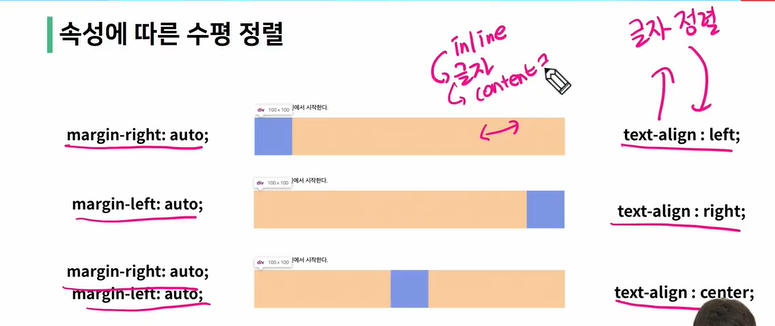

3. display: inline-block
   
   - block과 inline 레벨 요소의 특징을 모두 가짐
   - inline처럼 한 줄에 표시할 수 있고, block처럼 width, height, margin 속성을 모두 지정할 수 있음

4. display: none
   
   - 해당 요소를 화면에 표시하지 않고, 공간조차 부여되지 않음

5. visibility: hidden
   
   - 공간은 차지하나 화면에 표시만 하지 않는다.

### CSS 포지션

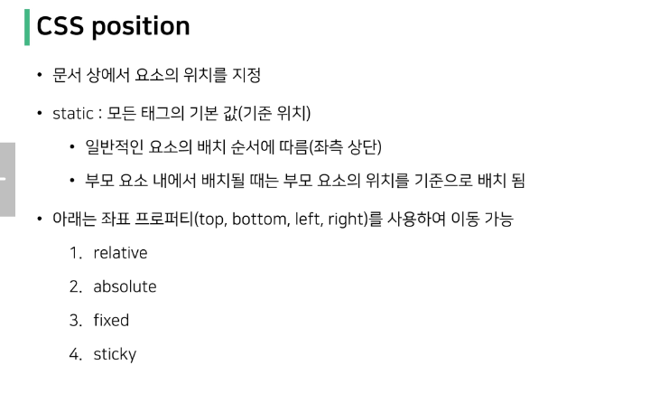

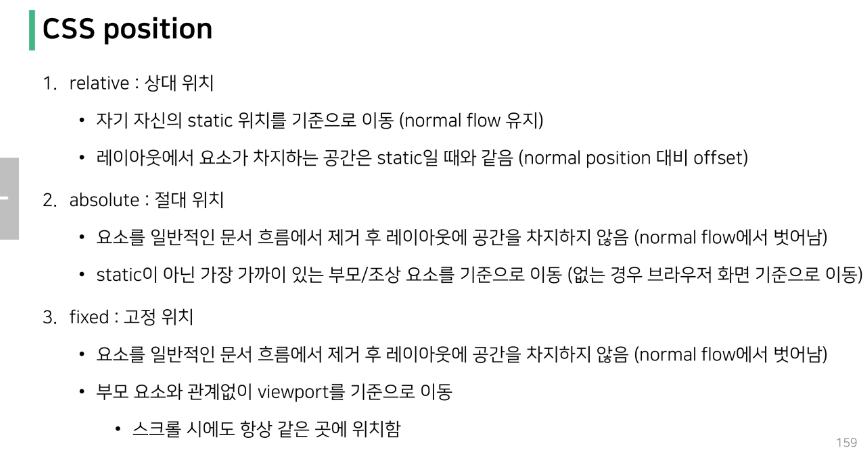

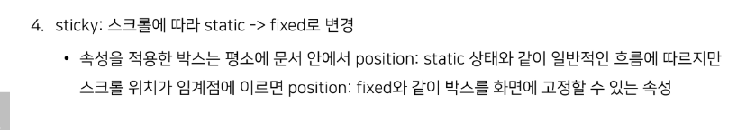

1. static

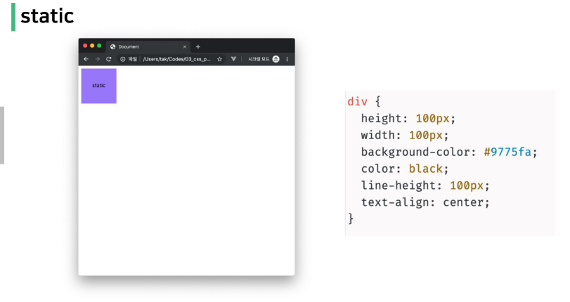

2. relative

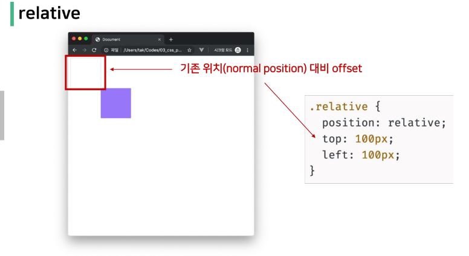

3. absolute   
   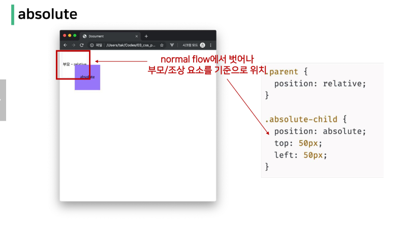
4. fixed   
   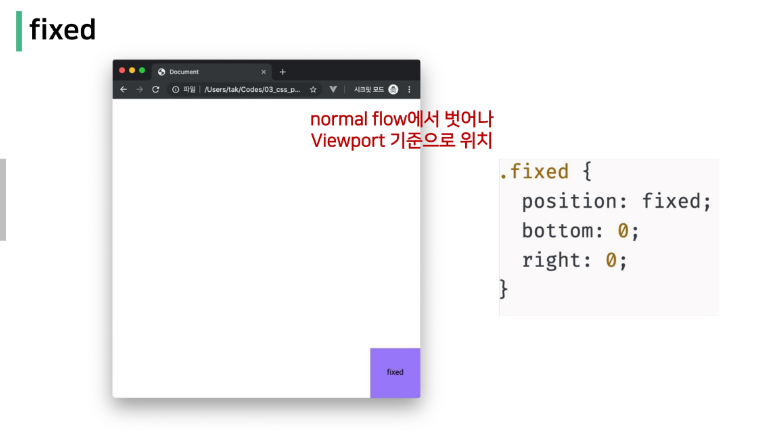

**absolute vs relative**

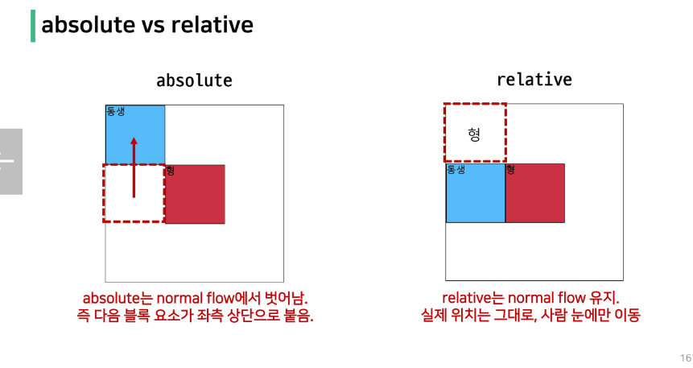

> absolute : 부모를 기준 가운데 위치
> fixed : 브라우저를 기준으로 우측 하단에 위치

#### position sticky

- 스크롤에 따라 static -> fixed로 변경

##### 원칙 정리

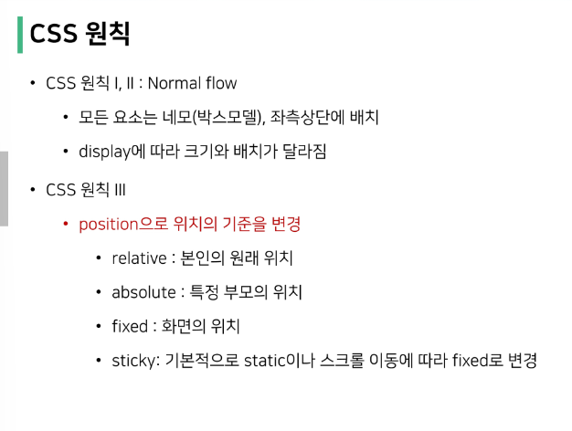