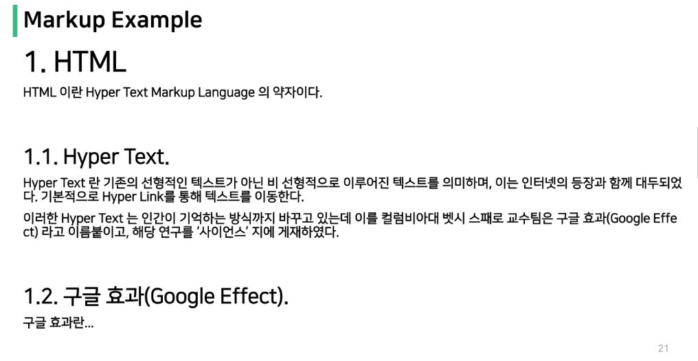

# Web

### 웹 사이트 간략하게 살펴보기

> 웹 사이트란 ?

- 브라우저를 통해 접속하는 웹 페이지(문서)들의 모음
- 웹 페이지는 여러가지 정보들을 담고 있으며 **링크**들이 존재하고, **링크**를 통해 여러 웹 페이지를 연결한 것이 `웹 사이트`

> 구성 요소

1. HTML - 구조
2. CSS - 표현
3. Javascript - 동작

> 브라우저

- 크롬, edge, firefox ...
- 브라우저마다 동작이 약간씩 달라 문제 생기는 경우 많음(`파편화`)
- **해결책**으로 `웹 표준`이 등장

> 웹 표준

- 웹에서 표준적으로 사용되는 기술이나 규칙
- 어떤 브라우저든 웹 페이지가 동일하게 보임(`크로스 브라우징`)

---

# HTML (Hyper Text Markup Language)

- 웹 페이지를 작성(구조화)하기 위한 언어

> Hyper Text

- 참조(하이퍼링크)를 통하여 한 문서에서 다른 문서로 즉시 접근할 수 있는 텍스트
- 문서와 문서를 이을 수 있는 기술

> Markup Language

- 태그 등을 이용하여 문서나 데이터의 구조를 명시하는 언어

- ex) HTML, Markdown
  
  **step** - 역순으로 진행된다고 보면 된다.

> 스타일 가이드

1. html = 2space, python = 2space
2. 기본 구조
- html : 문서의 최상위(root) 요소
- head : 문서의 메타데이터 요소
  : 문서 제목, 인코딩, 스타일 외부 파일 로딩 등 일반적으로 브라우저에 나타나지 않는 내용
- body: 문서 본문 요소
  : 실제 화면 구성과 관련된 내용

> head 예시

1. title : 브라우저 상단 타이틀
2. meta : 문서 레벨 메타데이터 요소
3. link : 외부 리소스 연결 요소 (CSS 파일, favicon 등)
4. script : 스크립트 요소 (JavaScript 파일/코드)
5. style : CSS 직접 작성

> 요소(element)

1. 태그와 내용으로 구성
- `<h1> contents</h1>`
- 태그로 컨텐츠를 감싸는 것으로 그 정보의 성격과 의미를 정의
- 내용이 없는 태그들도 존재(닫는 태그 없음)
2. 요소는 중첩될 수 있음
- 요소의 중첩을 통해 하나의 문서를 구조화
- 여는 태그와 닫는 태그의 쌍을 잘 확인 해야됨(레이아웃이 깨진 채로 출력)

> 속성(attribute)

- ``
- href = 속성명, 주소 = 속성값
- 태그별로 사용할 수 있는 속성 다르다
  **작성 방식**
- 속성명과 속성값 사이 공백 x
- " 쌍따옴표 " 사용
1. 태그의 부가적인 정보를 설정할 수 있음
2. 요소는 속성을 가질 수 있으며, 경로나 크기와 같은 추가 정보 제공
3. 요소의 시작 태그에 작성하며 보통 이름과 값이 하나의 쌍으로 제공
4. 태그와 상관없이 사용 가능한 속성들도 있음

> HTML Global Attribute

- 모든 HTML 요소가 공통으로 사용할 수 있는 대표적인 속성
1. id : 문서 전체에서 유일한 고유 식별자 지정
2. class : 공백으로 구분된 해당 요소의 클래스 목록(CSS, JS에서 요소를 선택하거나 접근)
3. data-*: 페이지에 개인 사용자 정의 데이터를 저장하기 위해 사용
4. sytle : inline 스타일
5. title : 요소에 대한 추가 정보 지정
6. tabindex : 요소의 탭 순서

> 시맨틱 태그

- HTML 태그가 특정 목적, 역할 및 의미적 가치(semantic value)를 가지는 것
  :(ex - h1 태그는 최상위 제목인 텍스트를 감싸는 역할)
  
  

**사용 이유**

- 의미 있는 정보의 그룹을 태그로 표현
- 요소의 의미가 명확해지기 때문에 코드의 가독성을 높이고 유지보수를 쉽게 함
- 검색 엔진 최적화를 위해 메타태그, 시맨틱 태그 등을 통한 마크업을 효과적으로 활용 해야함

> 렌더링

1. 웹사이트의 코드를 사용자가 보게 되는 웹 사이트로 바꾸는 과정
2. **DOM(Document Object Model) 트리**
- 텍스트 파일인 HTML 문서를 브라우저에서 렌더링 하기 위한 구조
- HTML 문서에 대한 모델을 구성함
- HTML 문서 내의 각 요소에 접근/수정에 필요한 프로퍼티와 메서드를 제공함

#### 구조화

> 인라인/블록 요소

- 인라인 요소는 글자 취급
- 블록 요소는 한 줄 모두 사용

> 텍스트 요소

 

> 그룹 요소

 

> form
- 정보(데이터)를 서버에 제출하기 위해 사용하는 태크
- 속성
  1. action : form을 처리할 서버의 URL
  2. method : form을 제출할 때 사용할 HTTP 메서드(GET 혹은 POST)
  3. enctype : method가 post인 경우 데이터의 유형
    - application / x-www-form=urlencoded : 기본값
    - multipart/form-data : 파일 전송시 (input type이 file인 경우)