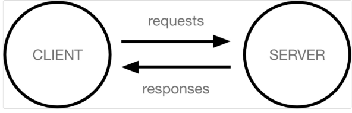
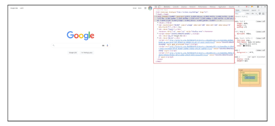
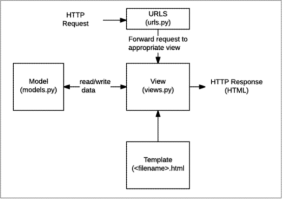
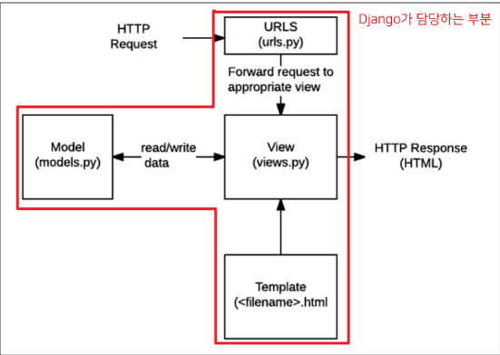

# Django

- '웹 서비스 개발'에는 뭐가 필요할까?
  
  > 1. 로그인, 로그아웃, 회원관리, 데이터베이스, 서버, 클라이언트, 보안 등
  > 2. 기술이 너무 많이 필요하다..
  > 3. 모두를 직접 만들 필요없이 잘 만들어진 것들을 가져다가 좋은 환경에서 잘 쓰기만 하면 된다!!

위의 기술 중 로그인, 로그아웃, 회원관리를 Django를 통해 할 수 있다.

#### # Framework 이해하기

- 누군가 만들어 놓은 코드 재사용하는 것 익숙한 개발 문화 -> '웹 서비스'도 코드 재사용하면 된다!
- 전 세계의 수많은 개발자들이 많이 개발해 봤고, 그 과정에서 자주 사용되는 부분들을 재사용 할 수 있게 좋은 구조의 코드로 만들어놨음
- 즉, **서비스 개발에 필요한 기능들을 미리 구현해서 모아 놓은 것**

> Frame(뼈대, 틀) + Work(일하다)

- 일정한 뼈대, 틀을 가지고 일하다

- 제공받은 도구들과 뼈대, 규약을 가지고 무언가를 만드는 일

- 특정 프로그램을 개발하기 위한 여러 도구들과 규약을 제공하는 것

- **따라서** Framework를 잘 사용하기만 하면 웹 서비스 개발에 있어 직접 개발할 필요 없이, 본질(로직)에 집중 할 수 있음

- 소프트웨어의 생산성과 품질을 높임

#### # Why learn Django??

1. python으로 작성된 프레임워크
   - python이라는 언어의 강력함과 거대한 커뮤니티
2. 수많은 여러 유용한 기능들
3. 검증된 웹 프레임워크
   - 화해, Toss, 두나무, 당근 등
   - 유명한 많은 서비스들이 이용한다는 것 == 안정적으로 서비스를 할 수 있다는 검증

# Web

장고를 배우기 전에 html, css 때도 봤던 web에 대해 알아보고 가자.

> 인터넷이란?

- 웹 브라우저를 켜고 주소창에 주소를 입력(www.google.com)
- www, wmr World Wide Web은 **'전 세계에 퍼져 있는 거미줄 같은 연결망**

> 어떻게 연결되어 있을까?

- 우리가 구글 홈페이지 접속 할 수 있는 이유는, 구글 본사 컴퓨터와 우리 컴퓨터 간 통신이 연결 되어 있기 때문.
- 전세계는 아주 두껍고 튼튼한 해저케이블로 연결
- 이렇게 촘촘하고 거대한 유선으로 연결 되어있고, 아주 많은 전봇대를 거쳐 집에 연결
- 유선 연결의 한계
  - 오지나 개발 도상국 같은 곳에서는 충분한 인프라를 기대하기 어려움
  - **"정보의 빈곤"**

이외에 **스타링크**와 같이 위성끼리의 데이터 교환 프로젝트 존재

> 결국 우리가 인터넷을 이용한다는 건, 전세계의 컴퓨터가 연결되어 있는 **하나의 인프라**를 이용하는 것

# # 클라이언트와 서버

- 오늘날 우리가 사용하는 대부분의 웹 서비스는 ```클라이언트-서버 구조```를 기반 동작

- **클라이언트와 서버** 역시 하나의 컴퓨터이며 간소화된 다이어그램은 이렇다.
  
  
  
  클라이언트

- 웹 사용자의 인터넷에 연결된 장치(ex. wi-fi에 연결된 컴퓨터 또는 모바일)

- Chrome 또는 Firefox와 같은 웹 브라우저

- 서비스를 요청하는 주체

> 서버

- 웹 페이지, 사이트 또는 앱을 저장하는 컴퓨터
- 클라이언트가 웹 페이지에 접근하려고 할 때 서버에서 클라이언트 컴퓨터로 웹페이지 데이터를 응답해 사용자의 웹 브라우저에 표시됨
- 요청에 대해 서비스를 응답하는 주체

즉, **GOOGLE 홈페이지.HTML**을 달라고 요청한 컴퓨터, 웹 브라우저를 **클라이언트**
반대로 파일을 제공한 컴퓨터, 프로그램을 **서버**

- 어떠한 자원(resource)를 달라고 요청(request)하는 쪽을 ```클라이언트```, 자원 제공해주는 쪽을 ```서버```

> 우리가 사용하는 웹은 클라이언트-서버 구조이며 Django는 서버를 구현하는 웹 프레임워크

## # 웹 브라우저?

- 웹에서 페이지를 찾아 보여주고, 사용자가 하이퍼링크를 통해 다른 페이지로 이동할 수 있도록 하는 프로그램

- 웹 페이지 파일을 우리가 보는 화면으로 바꿔주는(렌더링, rendering) 프로그램

- 빼곡한 코드로 작성된 HTML 문서를 서버로 부터 전달받아 아래와 같이 변경

- HTML/CSS/JS 등의 코드를 읽어 실제 사람이 볼 수 있는 화면으로 만들어 줌
  
  
  
  ##### # 웹 페이지?
  
  - 우리가 보는 화면 각각 한 장 한 장이 웹 페이지
  - 종류
    1. 정적 웹페이지
       - Static web page
       - 있는 그대로를 제공(served as-is)
       - 한 번 작성된 HTML 파일의 내용이 변하지 않고 모든 사용자에게 동일한 모습으로 전달되는 것
       - == 서버에 미리 저장된 HTML 파일 그대로 전달된 웹 페이지
       - == 같은 상황에서 모든 사용자에게 동일한 정보 표시
    2. 동적 웹페이지
       - Dynamic Web page
       - 사용자의 요청에 따라 웹 페이지에 추가적인 수정이 되어 클라이언트에게 전달되는 웹 페이지
       - 웹 페이지의 내용을 바꿔주는 주체 == **서버**
         - 서버에서 동작하고 있는 프로그램이 웹 페이지를 변경해줌
         - 이렇게 사용자의 요청을 받아서 적절한 응답을 만들어주는 프로그램을 쉽게 만들 수 있게 도와주는 프레임워크가 Django
       - 다양한 서버 사이드 프로그래밍 언어 사용가능하며 파일 처리하고 데이터베이스와의 상호작용

## # 장고 구조이해하기

#### Design Pattern

- 여러 작업을 하다보니 **자주 사용되는 구조**가 있다는 것을 알게 되고, 이를 **일반화해서 하나의 공법**으로 만들어 둔 것
- SW의 관점
  - 각기 다른 기능을 가진 다양한 응용 SW를 개발할 때 공통적인 설계 문제 존재, 이를 처리하는 해결책 사이에도 공통점이 있다는 것 발견
  - 이런 유사점을 패턴이라고 함

#### # 소프트웨어 디자인 패턴

- 앞서 배웠던 클라이언트-서버 구조도 소프트웨어 디자인 패턴 중 하나

> 목적

- 특정 문맥에서 공통적으로 발생하는 문제에 대해 재사용 가능한 해결책 제시
- 프로그래머가 어플이나 시스템을 디자인 할 때 발생하는 공통된 문제들을 해결하는데 형식화 된 가장 좋은 관행

> 장점

- 디자인 패턴을 알고 있다면 서로 복잡한 커뮤니케이션이 매우 간단해짐
- Before: 하나하나 고민해야됨. -> "무언가 서비스를 요청을 하는 쪽을 만들고 주고받는 방식 정의하고...."
- After: "우리 이거 클라-서버 구조로 구현하자"

즉, 다수의 엔지니어들이 일반화된 패턴으로 소프트웨어 개발을 할 수 있도록 한 규칙, **커뮤니케이션의 효율성을 높이는 기법**

#### #Django's Design Pattern

- 장고에 적용되어 있는 디자인 패턴은 **MTV 패턴**
- MTV 패턴은 MVC 디자인 패턴을 기반으로 조금 변형된 패턴

> MVC 소프트웨어 디자인 패턴

- MVC는 Modle -View- Controller의 준말
- 데이터 및 논리 제어를 구현하는데 널리 사용되는 소프트웨어 디자인 패턴
- 하나의 큰 프로그램을 세가지 역할로 구분한 개발 방법론
1. ModeL: 데이터와 관련된 로직을 관리
2. View: 레이아웃과 화면을 처리
3. Controller: 명령을 modle과 view 부분으로 연결

> 목적

- "관심사 분리"
- 더 나은 업무의 분리와 향상된 관리를 제공
- 각 부분을 독립적으로 개발할 수 있어, 하나를 수정하고 싶을 떄 모두 건들지 않아도 됨
- == 개발 효율성 및 유지보수가 쉬워짐
- == 다수의 멤버로 개발하기 용이함

> MTV

- MVC와 크게 다른 점은 없으며 일부 역할에 대해 부르는 이름이 다름
1. Model
   
   - MVC 패턴에서 Model의 역할에 해당
   - 데이터와 관련된 로직을 관리
   - 응용프로그램의 데이터 구조를 정의하고 데이터베이스의 기록을 관리

2. Template
   
   - 레이아웃과 화면을 처리
   - 화면상의 사용자 인터페이스 구조와 레이아웃을 정희
   - MVC 패턴에서 View의 역할에 해당

3. View
   
   - Model & Tempate과 관련한 로직을 처리해서 응답을 반환
   
   - 클라이언트의 요청에 대해 처리를 분기하는 역할
   
   - 동작 예시
     
     - 데이터가 필요하다면 mode에 접근해서 데이터를 가져오고 가져온 데이터를 template로 보내 화면을 구성하고 구성된 화면을 응답으로 만들어 클라이언트에게 반환
   
   - MVC 패턴에서 Controller의 역할에 해당
     
     
     
     
  **작업 순서** 꼭 지켜서 해주자 !!!!!

> Django는 MTV 디자인 패턴

- Model : 데이터 관련
- Template : 화면 관련
- View: Model & Template 중간 처리 및 응답 반환