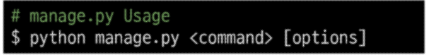
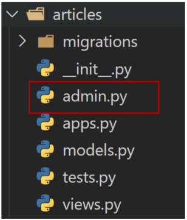
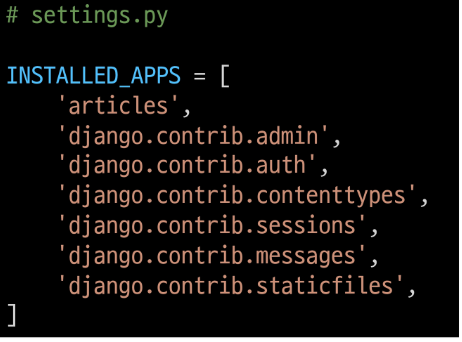
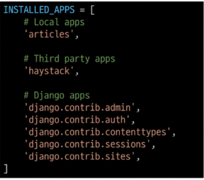

```python
1. .gitignore.io 들어가서 추가하고 파일 만들기(최상위 폴더)
        # 가상환경을 git에 계속 올려줄 필요가 없다. 따라서 gitignore를 통해 제외해준다.

2. python -m venv venv
        # 가상환경 실행해준다. 내가 사용할 폴더 내에서 실행!

3. source venv/Scripts/activate
        # 현재 실행중인지 확인

4. pip install django==3.2.13
        # 가상 환경 내에서도 django를 설치해준다.

5. pip freeze > requirements.txt
        # 패키지 목록을 생성해준다.

6. pip install -r requirements.txt
```

### ------ 장고 시작위한 준비완료

```python
1. django-admin startproject firstpjt . # 프로젝트 이름에는 '-' 및 사용중인 키워드 사용 불가
                                         # 장고에게 명령, # firstpjt 를 만들어라 , 뒤에 . 찍어주는 거 중요하다.
                                        # . 을 붙이지 않는 경우 현재 디렉토리에 프로젝트 디렉토리를 새로 생성하게 됨


2. python manage.py runserver # 프로젝트 서버 켜 # 끌때는 컨트롤 c


3. python manage.py startapp articles #  새로운 앱 생성
```

##### # firstpjt 생성화면



1. __init__.py
   
        - python에게 이 디렉토리를 하나의 python 패키지로 다루도록 지시
        - 별도 추가 코드 x

2. asgi.py
   
        - Asynchronous Server Gateway Interface
        - Django 애플리케이션이 비동기식 웹 서버와 연결 및 소통하는 것을 도움
        - 추후 배포 시 사용

3. setting.py
   
        - Django 프로젝트 설정을 관리

4. urls.py
   
        - 사이트의 url과 적절한 view의 연결을 지정

5. wsgi.py
   
        - Web Server Gateway Interface
        - Django 애플리케이션이 웹서버와 연결 및 소통하는 것을 도움
        - 추후 배포 시 사용

6. manage.py
   
        - Django 프로젝트와 다양한 방법으로 상호작용하는 커맨드라인 유틸리티
   
   

##### # articles 폴더 생성



1. admin.py
   
        - 관리자용 페이지를 설정 하는 곳

2. apps.py
   
        - 앱의 정보가 작성된 곳
        - 별도로 추가 코드를 작성하지 않음

3. models.py
   
        - 애플리케이션에서 사용하는 Model을 정의하는 곳
        - MTV 패턴의 M에 해당

4. tests.py
   
        - 프로젝트의 테스트 코드를 작성하는 곳

5. views.py
   
        - view 함수들이 정의 되는 곳
        - MTV 패턴의 V에 해당

### 애플리케이션 등록

- 반드시 생성 후 신고를 해주어야 한다 !!!!

- firstpjt 폴더내의 setting.py 찾아 들어가서 사진과 같이 ```app name```을 넣어준다
  
  

- 프로젝트에서 앱을 사용하기 위해서는 반드시 INSTALLED_APPS 리스트에 반드시 추가
  
  > INSTALLED_APPS

- Django installation에 활성화 된 모든 앱을 지정하는 문자열 목록

> **project & application**

1. project
   
        - "collection of apps"
        - 프로젝트는 앱의 집합이며 여러 앱이 포함될 수 있다.
        - 앱은 여러 프로젝트에 있을 수 있다.

2. Application
   
        - 앱은 실제 요청을 처리하고 페이지를 보여주는 등의 역할 담당
        - 일반적으로 앱은 하나의 역할 및 기능 단위로 작성하는 것을 권장함

###### # 주의사항

1. **"반드시 생성 후 등록"**
   
        - INSTALLED_APPS에 먼저 작성(등록)하고 생성하려면 앱이 생성되지 않음

2. 해당 순서를 지키지 않아도 수업 중 문제없지만, 추후 advanced한 내용을 대비하기 위해 지키는 것 권장
   
   
