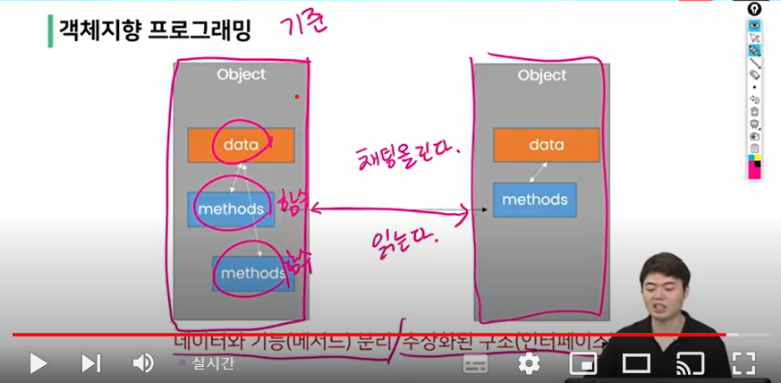
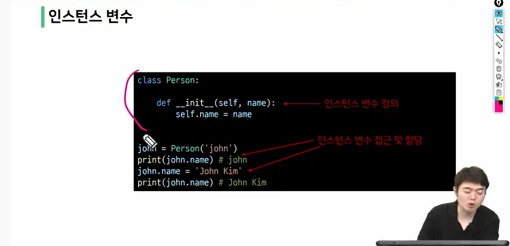
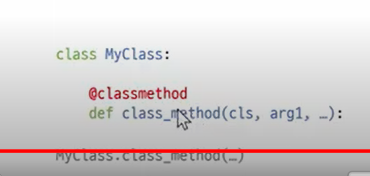
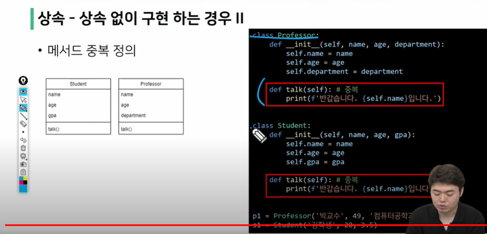
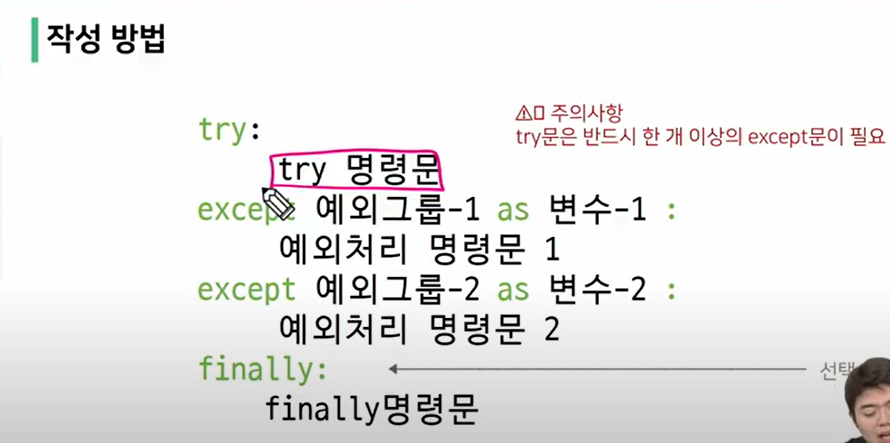
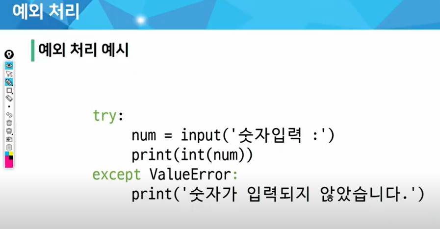

# 0720

# 함수의 결과값

> - Void function
>   
>   - 명시적인 return 값이 없는 경우, None을 반환하고 종료
> 
> - Value returning function
>   
>   - 함수 실행 후, return문을 통해 값 반환
>   
>   - return을 하게 되면, 값 반환 후 함수가 바로 종료
> 
> - print는 값을 출력하지만 반환하지는 않는다 !
>   
>   - **print를 사용하면 호출될 때마다 값이 출력**
>   
>   - **데이터 처리를 위해서는 return 사용**

###### 두 개 이상의 값 반환

> 반환 값으로 튜플 사용
> 
> ```python
> return x -y, x*y
> function(4, 5)
> ```

> 또는 리스트와 같은 컨테이너 활용

###### Argument

> - 함수 호출 시 함수의 parameter를 통해 전달되는 값
> 
> - 소괄호 안에 할당 func_name(argument)
>   
>   - 필수 : 반드시 ! 존재
>   
>   - 선택 : 값을 전달하지 않는 경우 기본값 전달
> 
> **1. positional Arguments**
> 
> **2. Keyworkd Arguments**
> 
>     - 2번 다음에 1번을 활용 x
> 
> ```python
> add(x=2, y=5)
> add(2, y=5)
> add(x=2, 5) -> Error발생
> ```

> **3. Default Arguments Values**
> 
> - 기본값을 지정하여 함수 호출 시 argument 값을 설정하지 않도록 함
> 
> ```python
> def add(x, y=0)
> ```

###### 가변 인자 (*args)

> - 여러 개의 Positional Argument를 하나의 필수 parameter로 받아서 사용
> 
> - 몇 개의 positional Argument를 받을지 모르는 함수를 정의할 때 유용

###### 패킹 / 언패킹

> - 여러 개의 데이터를 묶어서 변수에 할당 -> 패킹
> 
> - 시퀸스 속의 요소들을 여러 개의 변수에 나누어 할당 -> 언패킹
>   
>   - 언패킹시 *를 왼쪽에 붙이면, 할당하고 남은 요소 담음

###### 가변 키워드 인자(**kwargs)

> - 몇 개의 키워드 인자를 받을지 모르는 함수를 정의할 때 유용
> 
> - 딕셔너리로 묶여 처리 되며, parameter에 **를 붙여 표현

##### 가변 인자와 가변 키워드 인자 동시 사용 가능

```python
def print_family_name(*parents, **pets)
```

---

# Python의 범위(Scope)

> - 함수는 코드 내부에 local scope를 생성하며
>   그 외의 공간인 global scope로 구분
> 
> - variable도 마찬가지

#### 변수 수명주기(lifecycle)

> - 변수는 각자의 수명주기 존재
>   
>   - built-in scope
>     
>     - 파이썬 실행 이후 영원히 유지
>   
>   - global scope
>     
>     - 모듈 호출 시점 혹은 인터프리터 끝날 때까지 유지
>   
>   - local scope
>     
>     - 함수가 호출될 때 생성되고, 종료될 때 소멸

## 이름 검색 규칙(Name Resolution)

> - **LEGB Rule에 따라 찾아나간다.**
>   
>   1. Local scope : 현재 작업중 범위
>   
>   2. Enclosed scope : 지역 범위 한 단계 위 범위
>   
>   3. Global scope : 최상단에 위치한 범위
>   
>   4. Built-in scope : 모든 것을 담고 있는 범위 (정의하지 않고 사용할 수 있는 모든 것) - print
> 
> . 함수 내에서는 바깥 Scope의 변수에 접근 가능하나 수정은 할 수 없다 !
> 
> ```python
> a = 0
> b = 1
> def enclosed():
>     a=10
>     c=3
>     def local(c):
>         print(a,b,c) # 10 1 300
>     local(300)
>     print(a,b,c) # 10 1 3
> enclosed()
> print(a,b) # 0 1
> ```

###### global 문

> - 현재 코드 블록 전체에 적용되며, 나열된 식별자(이름)이
>   global variable임을 나타냄
>   
>   - global에 나열된 이름은 같은 코드 블록에서 global 앞에 등장할 수 없음
>   
>   - global에 나열된 이름은 parameter, for 루프 대상, 클래스/함수 정의 등으로 정의되지 않아야 함
> 
> ```python
> a = 10
> def func1():
>     global a
>     a = 3
> print(a) #10
> func1()
> print(a) #3
> 
> #Local scope에서 global 변수 값의 변경
> #global 키워드를 사용하지 않으면, local scope에 a변수 생
> ```

##### nonlocal

> - global 제외 가장 가까운 scope의 변수를 연결
> 
> - nonlocal에 나열된 이름은 같은 코드 블록에서 nonlocal앞에 등장할 수 없음
> 
> - nonlocal에 나열된 이름은 parameter, for 루프 대상, 클래스/함수 정의 등으로 정의되지 않아야 함
> 
> - **nonlocal의 경우 이미 존재하는 이름과의 연결만 가능함**
> 
> - ```python
>   x = 0
>   def func1():
>       x = 1
>       def func2()
>           nonlocal x
>           x = 2
>       func2()
>       print(x) #2
>   
>   func1()
>   print(x) #0
>   ```

## 주의사항!

> - 기본적으로 local scope에 생성되며, 종료시 사라짐
>   
>   - 단, 함수 내에서 필요한 상위 scope 변수는 argument로 넘겨서 활용
> 
> - 상위 scope에 있는 변수 수정하고 싶다면, global, nonlocal 키워드 활용가능
>   
>   - 단, 코드 복잡해지고 예기치 못한 오류
>   
>   - **함수로 값을 바꾸고자 한다면 항상 argument로 넘기고 리턴 값 사용하는 것을 추천**

---

# 함수의 응용

**1. map(function, iterable)**

- 순회 가능한 데이터구조의 모든 요소에 함수적용하고, 그 결과를
  map object로 반환

- 알고리즘 문제 풀이시 input 값들을 숫자로 바로 활용하고 싶을 때
  
  ```python
  n, m = (int, input().split())
  
  reseult = map(str, numbers)
  ```

**2. filter(function, iterable)**

- 순회 가능한 데이터구조의 모든 요소에 함수적용하고, 그 결과가 True인 것들을 filter object로 반환

```python
def odd(n):

result = filter(odd, numbers)
```

**3.zip(*iterables)***

- 복수의 iterable을 모아 튜플을 원소로 하는 zip object를 반환

```python
girls = ['d'. 'f']
boys = ['a','b']
pair = zip(girls, boys)
```

**4.lambda[parameter]:표현식**

- 익명함수

- return문 및 간편 조건문 외 조건문이나 반복문 가질 수 x

- 장점
  
  - 함수를 정의해 사용하는 것보다 간결
  
  - def를 사용할 수 없는 곳에서도 사용가능

```python
#삼각형 넓이 - def
def area(b,h)
    return o.5 * b* h
#삼각형 - 람다
area = lamda b, h : 0.5 *b*h
```

**5.재귀 함수**

- 자기 자신을 호출

- 알고리즘 설계 및 구현에서 유용하게 활용

- 변수의 사용 줄어들며, 코드 가독성 높아짐

- 1개 이상의 base case(종료되는 상황)가 존재하고, 수렴하도록 작성

```python
#factorial
n!
n*(n-1)!


f(3) = 3*f(2)
f(2) = 2*f(1)
f(1) = 1 -> base case

def factorial(n):
    if n ==0 or n==1:
        return 1
    else:
        return n * factorial(n-1)
#for문으로 구현
def factorial(n):
    result = 1
    while n> 1:
        result *= n
        n -= 1
    return result
    
```

- **주의사항** 
  
  - 메모리 스택이 넘치게 되면 프로그램이 동작하지 않게 됨
  
  - 파이썬에서는 최대 재귀 깊이가 1,0000번으로, 호출 횟수가 이를 넘어가게 되면 Recursion Eroor 발생

---

# 모듈

> - 다양한 기능을 하나의 파일로
> 
> - 특정 기능을 하는 코드를 파이썬 파일(.py) 단위로 작성한 거

# 패키지

> - 다양한 모듈을 하나의 묶음으로
> 
> - 활용공간 = 가상환경
> 
> - 패키지 안에는 또 다른 서브 모듈

# 라이브러리

> 다양한 패키지를 하나의 묶음으로

# PIP

> 이것들을 관리하는 관리자

### 불러오기 !

```python
import module
from module import var, funcion, Class
from module import *

from package import module
from package.module import var, function, Class
```

#### 파이썬 기본 설치된 모듈과 내장함수

- [내장 모듈](https://docs.python.org/ko/3/library/index.html)

- 설치
  
  ```python
  $ pip install Somepackage
  $ pip install Somepackage == 1.0.5
  $ pip install Somepackage >=1.0.4'
  ```

- 삭제
  
  ```python
  $ pip uninstall Somepackage
  ```

- 그 외 명령어
  
  ```python
  # 리스트
  $ pip list
  
  #정보
  $ pip show Somepackage 
  
  #관리
  $ pip freeze> requirements.txt
  $ pip install -r requirements.txt
  ```

## 가상환경

> 파이썬 표준 라이브러리가 아닌 외부 패키지와 모듈을 사용하는 경우
> 모두 pip를 통해 설치를 해야함
> 
> 버전이 상이 할 수 있어 가상환경을 만들어 프로젝트별로 독립적 패키지 관리 가능
> 
> ```python
> python -m venv venv #가상환경 이름
> source - venv/Scripts/activate
> # 아무것도 없는 상태에서
> pip list
> pip freeze > requir
> pip install requests
> ```

-- -

# 0725

# 데이터 구조

## 시퀀스 형

### 1. 문자열

- 모든 문자는 str타입(변경 불가능한 immutable)

```python
  #문자열 조회/탐색
  s.find(x) # x의 첫 번째 위치 반환, 없으면 -1을 반환
  s.index(x) #x의 첫 번째 위치를 반환, 없으면 오류 발생
```

```python
  #문자열 검증
  s.isalpha() #알파벳 문자여부, 유니코드상 letter
  s.isupper() #대문자 여부
  s.islower() #소문자여부
  s.istitle() #타이틀 형식여부 (띄어쓰기 기준)
  isdemical() < isdigit() < isnumerical()  # 숫자 검증
```

```python
  #문자열 변경
  s.replace(old, new[, count]) # 대상 글자 반환, count지정시 대상 개수만 반환
  s.strip([chars]) # 공백이나 특정 문자 제거 # lstrip, rstrip으로 한쪽만 날릴 수도 잇음

  s.split(sep=None, maxsplit= -1) #공백이나 특정문자 기준 분리
  # sep이 None이거나 빈값이면 연속된 공백문자를 단일 공백으로 간주
  # maxsplist이 -1이면 제한없음
 'separator'.join([iterable]) #구분자로 iterable을 합침
  s.capitalize() #가장 첫째글자 대문자로 변경
  s.title() #문자열 내 띄어쓰기 기준으로 각 단어 첫자 대문자
  s.upper() #모두 대문자
  s.lower() #모두 소문자
  s.swapcase() #대 - 소문자 서로 변경
```

### 2. 리스트

```python
#리스트 메서드
l.append(x) # 마지막 항목에 x추가
l.insert(i,x) # 리스트 인덱스 i에 x추가, 리스트 길이보다 큰 경우 맨뒤
l.remove(x) #리스트 가장 왼쪽에 있는 x제거, 존재안하면 ValueError
l.pop() # 리스트 가장 오른쪽에 있는 항목을 반환 후 제거
l.pop(i) #리스트 인덱스 i에 있는 값을 반환후 제거,  i지정안할시 마지막값 반환 후 삭제
l.extend(m) # 순회형 m의 모든  항목들의 리스트 끝에 추가(+=)
          # cafe.extend('coffee') 로 문자열 추가시 c, o , f , f 와 같이 쪼개져서 드감
        #리스트 +리스트 해서 하나의 긴 리스트 된다

l.index(x, start, end) #리스트에 있는 항목 중 가장 앞에 있는  항목x의 인덱스를 반환
l.reverse() #리스트 거꾸로 정렬
l.sort() #원본리스트를 정렬(매개변수 이용가능), None 반환, sorted함수와 비교 - 정렬된 리스트를 반환
l.count(x) #리스트에서 항목 x가 몇 개 존재하는지 갯수를 반환 
```

### 3. 튜플

- 여러 개의 값을 순서가 있는 구조로 저장하고 싶을 때 사용
- 리스트와의 차이점 == 생성 후 , 담고있는 값 변경 불가
- 항상 소괄호 형태로 사용
- **변경할 수 없기 때문에 값에 영향 안주는 메서드만 지원**
- 리스트 메서드 중 항목 변경하는 메서드들 제외하고 대부분 동일

a.**멤버십 연산자**

- 멤버십 연산자 in을 통하여 특정 요소가 속해 있는지 여부 확인
- not in

b.**시퀀스형 연산자**

- 산술연산자 (+)
  : 시퀀스간의 concentration

- 반복연산자(*)
  : 시퀀스를 반복

## 비시퀀스형

### 1. set

- 중복 요소가 없이 존재, 순서에 상관없는 데이터들
  : 중복되는 요소는 하나만 저장, 인덱스 사용 x

- 담고 있는 요소 삽입 변경, 삭제 가능
  
  ```python
  s.copy() #셋의 얕은 복사본을 반환
  s.add() #항목 x가 셋s에 없다면 추가
  s.pop() #셋 s에서 랜덤하게 항목을 반환하고, 해당 항목 제거 set이 비어있을 경우 keyError
  s.remove(s) #항목 x를 셋 s에서 삭제, 항목 존재하지 않을 경우, KeyError
  s.discard(x) #항목 x가 셋s에 있는 경우, 항목 x를 셋s에서 삭제
  s.update(t) #셋 t에 있는 항목중 셋 s에 없는 항목 추가
  s.clear()
  s.isdisjoint(t) # 셋s가 셋t의 항목 하나도 없으면 True(서로소)
  s.issubset(t) # 셋s가 셋 t의 하위 셋인 경우, True반환
  s.issuperset(t) # 셋s가 셋 t의 상위 셋인 경우, True반환
  ```
  
  ### 2. 딕셔너리
  
  ```python
  d.clear()
  d.copy() # 얕은 복사본을 반환
  d.keys()
  d.values()
  d.items()
  d.get(k)
  d.get(k,v)  #키 k가 딕d에 없을 경우, v반환
  d.pop(k) # 삭제후 value값 반환
  d.pop(k,v)
  d.update([other]) 딕셔너리 d의 값을 매핑하여 업데이트
  ```

# 얕은 복사와 깊은 복사

### 할당

##### 1. 대입 연산자(=)

- 리스트 복사 확인하기 
- 대입 연사자를 통한 복사는 해당 객체에 대한 객체 참조를 복사
- 해당 주소의 일부 값을 변경하는 경우 이를 참조하는 모든 변수에 영향

### 얕은 복사

##### 1. Slice 연산자 활용

- 같은 원소를 가진 리스트지만 연산된 결과를 복사(다른 주소)
- **얕은 복사의 주의사항**
  : 복사하는 리스트의 원소가 주소를 참조하는 경우는 변경됨

### 깊은 복사

```python
b = copy.deepcopy(a) 같이 깊은 복사 이용
```

--- 

# 0727

# OOP (Object-Oriented Programming)

- 컴퓨터 프로그래밍의 패러다임 중 하나

- 컴퓨터 프로그램을 명령어의 목록으로 보는 시각에서 벗어나 여러 개의 독립된 단위, 즉 '객체'들의 모임으로 파악하고자 하는 것

- 각각의 객체는 메시지를 주고받고, 데이터를 처리할 수 있음
  
  ## 객체지향 프로그래밍이란?
  
  > 프로그램을 여러 개의 독립된 객체들과 그 객체 간의 상호작용으로 파악하는 프로그래밍 방법
  > ex) 콘서트 - 가수 객체, 감독 객체, 관객 객체
  
  ### 1. 절차지향 프로그래밍
  
  - 과거에 사용
  - 한 개의 Global data에 여러 함수를 사용
  - 정보 변경을 위해서는 연달아서 바꿔야 함
  
  ### 2. 객체지향의 등장
  
  - Object라는 꾸러미 안에 특정 기준에 맞춰서(스스로가 정함) 필요한 Data와 Method를 넣음
  
  - 데이터와 기능(Method) 분리, 추상화된 구조(인터페이스)
    
    

#### 필요한 이유는 ?

1. 추상화
- 복잡한거를 숨기로 필요한거를 보여준다.

# 객체(컴퓨터 과학)

> - 컴퓨터 과학에서 객체 또는 오브젝트는 클래스에서 정의한 것을 토대로 메모리(실제 저장공간)에 할당된 것으로 프로그램에서 사용되는 데이터 또는 식별자에 의해 참조되는 공간을 의미하며, 변수, 자료 구조, 함수 또는 메서드가 될 수 있다.
> - 즉 ! **속성과 행동**으로 구성된 모든것
>   

### 객체와 인스턴스

- 클래스로 만든 객체를 인스턴스 라고도 함
  
  

### 클래스와 객체

- 클래스(가수)와 객체(실제 사례)
- 클래스 = 타입(list)
  : 클래스를 만든다 == 타입을 만든다

##### 파이썬은 모든 것이 객체(object)

> 파이썬의 모든 것에는 속성과 행동이 존재

> ex) [3,2,1].sort()        'banana'.upper()
>     리스트. 정렬()            문자열.대문자로()
>     객체.행동()               객체.행동()
>   정보(객체[0]->3)           정보(iterable)       

###### 타입(class)와 실제 사례(인스턴스)

> [1,2,3], [1], [], ['hi']
>  : 모두 리스트 타입(클래스)의 객체

###### 객체는 특정 타입의 인스턴스이다.

- 123, 900, 5는 모두 int의 인스턴스
- 'hello', 'bye'는 모두 string의 인스턴스
- [232, 89, 1], []은 모두 list의 인스턴스

### 특징

1. 타입(type) : 어떤 연산자(operator)와 조작(method)이 가능한가?
2. 속성(attribute) : 어떤 상태(데이터)를 가지는가?
3. 조작법(method) : 어떤 행위(함수)를 할 수 있는가?

> 객체(Object) = 속성(Attribute) + 기능(Method)

## 기초 문법

- 클래스 정의 
  
  ```python
  class MyClass:
  ```

- 인스턴스 생성
  
  ```python
  my_instance = MyClass()
  ```

- 메서드 호출
  
  ```python
  my_instance.my_method()
  ```

- 속성
  
  ```python
  my_instance.my_attribute
  ```

> 객체의 설계도(클래스)를 가지고, 객체(인스턴스)를 생성한다.
> 파이썬은 모든 것이 객체, 모든 객체는 특정 타입의 인스턴스

##### 객체 비교하기

1. ==
- 동등한(equal)
- 변수가 참조하는 객체가 동등한(내용이 같은) 경우 True
- 두 객체가 같아 보이지만 실제로 동일한 대상을 가리키고 있다고 확인해 준 것은 아님
2. is
- 동일안(identical)
- 두 변수가 동일한 객체를 가리키는 경우 True  

## 속성

> 데이터, 정보, 상태 -> 변수

- 특정 데이터 타입/클래스의 객체들이 가지게 될 상태/데이터를 의미
- 클래스 변수/인스턴스 변수가 존재

##### 인스턴스 변수

> 인스턴스가 개인적으로 가지고 있는 속성(attribute)
> 각 인스턴스들의 고유한 변수

- 생성자 메서드``(__init__)``에서 ``self.<name>``으로 정의

- 인스턴스가 생성된 이후 ``<instance>.<name>``으로 접근 및 할당
  
  

##### 클래스 변수

> 클래스 선언 내부에서 정의
> ``<classname>.<name>``으로 접근 및 할당
> 
> 

**클래스 변수를 변경**

- 항상 클래스.클래스변수 형식으로 변경

- 인스턴스 변경시 **인스턴스.변수**
  
  

## 메서드

> 특정 데이터 타입/클래스의 객체에 공통적으로 적용 가능한 행위(함수)
> 클래스 안에 있는 함수 !

1. **인스턴스 메서드**
   : 인스턴스 처리 변수
   
   > 1.인스턴스 변수를 사용하거나, 인스턴스 변수에 값을 설정
   > 2.클래스 내부에 정의되는 메서드의 기본
   > 3.호출 시, 첫 번째 인자로 인스턴스 자기자신(self)가 전달됨
   > -> ``self``가 있으면 인스턴스 메서드
- self는 인스턴스 자기자신
- self를 첫 번째 인자로 정의, 암묵적 규칙

> a. 생성자(constructor) 메서드
> 
> - 인스턴스 객체가 생성될 때 자동으로 호출
> - 인스턴스 변수들의 초기값을 설정
> 
> b.  매직 메서드
> 
> - Doublt underscore(__)가 있는 메서드는 특수한 동작을 위해 만들어진 메서드로, 스페셜 메서드, 혹슨 매직 메서드
>   
>   
> 
> - 특수 조작 행위 지정
>   
>   - ``__str__`` : 해당 객체의 출력 형태 지정
>   - 프린트 함수 호출시, 자동 호출
>   - 어떤 인스턴스를 출력하면 __str__의 return 값이 출력
>   - ``__gt__``: 부등호 연산자

2. **클래스 메서드**
   : 클래스 처리 변수
   
   - `@classmethod` 데코레이터를 사용하여 정의
   
   - 호출 시, 첫 번째 인자로 클래스(cls)가 전달됨 
     
     

> **데코레이터**
> : 함수를 어떤 함수로 꾸며서 새로운 기능 부여
>   순서대로 적용 되기 때문에 작성 순서가 중요

###### 클래스 메서드와 인스턴스 메서드의 차이

- 클래스는 인스턴스 변수 사용 불가
- 인스턴스는 클래스 메서드와 스태틱 메서드에 모두 접근 가능
- 인스턴스 메서드는 클래스 변수, 인스턴스 변수 다 사용 가능
3. **정적 메서드(스태틱 메서드)**
   : 속성을 다루지 않고, 단지 기능만을 하는 메서드를 정의할 때 사용
   즉, 객체 상태나 클래스 상태를 수정 x
   
   > `@staticmethod` 데코레이터 사용
   > 일반 함수 동작이지만, 클래스의 이름공간에 귀속
   > 주로 해당 클래스로 한정하는 용도로 사용

### 인스턴스와 클래스 간의 이름 공간(namespace)

- 클래스를 정의하면, 클래스와 해당하는 이름 공간 생성
- 인스턴스를 만들면, 인스턴스 객체가 생성되고 이름 공간 생성
- 인스턴스에서 특정 속성에 접근하면, 인스턴스-클래스 순으로 탐색

# 객체지향의 핵심 4가지

#### 1. 추상화

- 현실 세계를 프로그램 설계에 반영

#### 2. 상속

-두 클래스 사이 부모 - 자식 관계를 정립하는 것

- 클래스는 상속이 가능함
  - 모든 파이썬 클래스는 object를 상속받음
- 하위 클래스는 상위 클래스에 정의된 속성, 행동, 관계 및 제약 조건을 모두 상속 받음
- 부모 클래스의 속성, 메서드가 자식 클래스에 상속되므로, 코드 재사용성이 높아짐

> 상속없이 구현하는 경우 학생/교수 정보를 나타내기 어려움
> 메서드 중복 정의됨
> 
> 
> 
> 

**상속 사용**


- 관련 함수와 메서드
  
  ```python
  isinstance(object, classinfo)
  #classinfo의 instance거나 subclass*인 경우 True
  ```
  
  ```python
  super()
  #자식클래스에서 부모클래스를 사용하고 싶은 경우
  ```

###### 상속 정리

> 1. 파이썬의 모든 클래스는 object로부터 상속됨
> 2. 부모 클래스의 모든 요소(속성, 메서드)가 상속됨
> 3. super()를 통해 부모 클래스의 요소를 호출할 수 있음
> 4. 메서드 오버라이딩을 통해 자식 클래스에서 재정의 가능함
> 5. 상속관계에서의 이름 공간은 인스턴스, 자식클래스, 부모 클래스 순으로 탄생

###### 다중 상속

- 두 개 이상의 클래스를 상속 받는 경우
- 상속받은 모든 클래스의 요소를 활용 가능함
- 중복된 속성이나 메서드가 있는 경우 상속 순서에 의해 결정됨 (앞에 써있는 클래스 반환)

A. 상속 관련 함수와 메서드

1. mro메서드(Method Resolution Order)
   
   > 해당 인스턴스의 클래스가 어떤 부모 클래스를 가지는지 확인하는 메서드
   > 기존의 인스턴스 -> 클래스 순으로 이름 공간을 탐색하는 과정에서 상속 관계에 있으면 인스턴스 -> 자식 클래스 -> 부모 클래스로 확장

#### 3. 다형성

- 동일한 메서드가 클래스에 따라 다르게 행동할 수 있음을 의미
- 즉, 서로 다른 클래스가 속해있는 객체들이 동일한 메시지에 대해 다른 방식으로 응답할 수 잇음

A. **메서드 오버라이딩**

- 상속받은 메서드를 재정의
  
  - 클래스 상속 시, 부모 클래스에서 정의한 메서드를 자식 클래스에서 변경
  
  - 부모 클래스의 메서드 이름과 기본 기능은 그대로 사용하지만, 특정 기능을 바꾸고 싶을 때 사용
    
    > 상속받은 클래스에서 같은 이름의 메서드로 덮어씀
    > 부모 클래스의 메서드를 실행시키고 싶은 경우 super를 활용

#### 4. 캡슐화

- 객체의 일부 구현 내용에 대해 외부로부터의 직접적인 액세스를  차단
- 파이썬 내에 암묵적 존재, 언어적으로 존재 x

>  Public Member

- 언더바 없이 시작하는 메서드나 속성
- 암묵적 규칙에 의해 부모클래스 내부와 자식 클래스에서만 호출 가능
- 하위 클래스 override 허용

>  Protected Member

- 언더바 1개로 시작하는 메서드나 속성
- 암묵적 규칙에 의해 부모 클래스 내부와 자식 클래스에서만 호출 가능
- 하위 클래스 overeride 허용

>  Private Member

- 언더바 2개로 시작하는 메서드나 속성
- 본 클래스 내부에서만 사용이 가능
- 하위클래스 상속 및 호출 불가능(오류)
- 외부 호출 불가능(오류)

> getter 메서드와 setter 메서드

- 변수에 접근할 수 있는 메서드를 별도로 생성
  - getter 메서드 : 변수의 값을 읽는 메서드
    - @property 데코레이터 사용
  - setter 메서드 : 변수의 값을 설정하는 성격의 메서드
    - @변수.setter 사용

#### 정리

- 추상화 : 복잡한거 숨기고, 필요한거 나타냄
- 상속 : 부모 클래스와 자식 클래스 관계 => 물려받기 -> 재사용
- 다형성 : 이름은 같은데, 동작은 다른 것 -> 오버라이딩 -> 부모 자식이 그대로(x) -> 자식이 변경
- 캡슐화 : 민감한 정보를 숨기는 것 -> getter, setter

## 버그란?

- 소프트웨어에서 발생하는 문제

## 디버깅의 정의

- 잘못된 프로그램을 수정하는 것

- 에러 메시지가 발생
  
  - 해당하는 위치를 찾아 메시지 해결

- 로직 에러가 발생하는 경우
  
  - 명시적인 에러 메시지 없이 예상과 다른 결과가 나온 경우
    - 정상적으로 동작하였던 코드 이후 작성된 코드를 생각해봄
    - 전체 코드 살펴봄
    - 휴식 가져봄
    - 누군가에게 설명해봄

- 해결하기
  
  > 1. print 함수 활용
  > 2. 개발 환경 등에서 제공하는 기능 활용
  > 3. Python tutor 활용
  > 4. 뇌컴파일, 눈디버깅

#### A. 문법 에러(Syntax Error)

1. Invalid syntax
   
   - 문법 오류

2. assign to literal
   
   - 잘못된 할당

3. EOL(End of Line)

4. EOF(End of File)

#### B. 예외(Exception)

- 실행 도중 예상치 못한 상황 맞이하면, 프로그램 실행 멈춤

- 실행 중에 감지되는 에러들을 예외라고 부름

- 예외는 여러 타입으로 나타나고, 타입이 메시지의 일부로 출력됨

- 모든 내장 예외는 Exception Class를 상속받아 이뤄짐

- 사용자 정의 예외를 만들어 관리할 수 잇음
  
  > 1. ZeroDivisionError
  > 2. NameError
  > 3. TypeError
  >    - 타입 불일치 (int +str)
  >    - argument누락
  > 4. ValueError
  > 5. KeyError
  > 6. IndexError
  > 7. ModuleNotFoundError
  > 8. ImportError
  >    : Module은 있으나 존재하지 않는 클래스/함수를 가져오는 경우
  > 9. KeyboardInterrupt
  >    : 임의로 프로그램을 종료할 때
  > 10. IndentationError
  >     : Indentation이 적절하지 않는 경우

#### C. 예외처리

- `try`문 / `except` 절을 이용하여 예외 처리를 할 수 있음
  A. try문
- 오류가 발생할 가능성이 있는 코드를 실행
- 예외가 발생되지 않으면, except 없이 실행 종료

B. except문

- 예외가 발생하면, except 절이 실행
- 예외 상황을 처리하는 코드를 받아서 적절한 조치를 취함

> 처리순서


- 작성 방법
  
  

- 예외 처리 예시
  
  

**예외 처리 종합**

- try : 코드를 실행함
- except : try문에서 예외가 발생 시 실행함
- else : try문에서 예외가 발생하지 않으면 실행함
- finally : 예외 발생 여부와 관계없이 항상 실행함